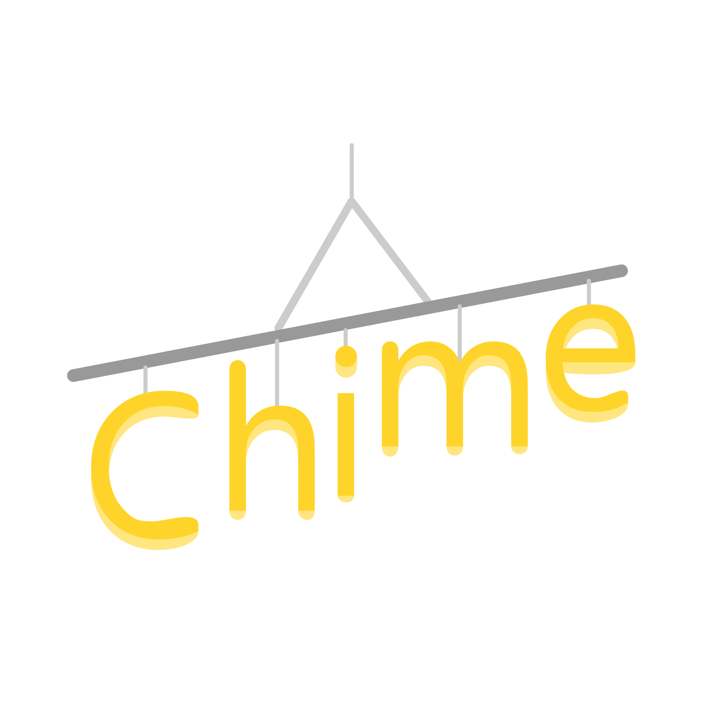

---

This repository is the monorepo for chime, a locally hosted music streaming server.

---

### Running/Building

It is recommended you run chime in Docker using docker-compose.
You can do this by running `./docker-run.sh`
This builds the project in Docker. It also creates a volume in your home directory for Chime's data.

---

### Project structure

- `server` - Contains the source code for the backend web server.
- `web` - Contains the source code for the web UI. This is served by the server.
- `app` - Source code for the desktop and mobile apps.
- `castproxy` - Source code for the Chromecast proxy to enable control of Chromecast devices from platforms where the Cast SDK is not supported.

### Credits

- Bootstrap Icons
- Svelte
- Gin
- [Chromecast Cast Button](https://icons8.com/icon/1I0NE97niMwR/chromecast-cast-button) icon by [Icons8](https://icons8.com)